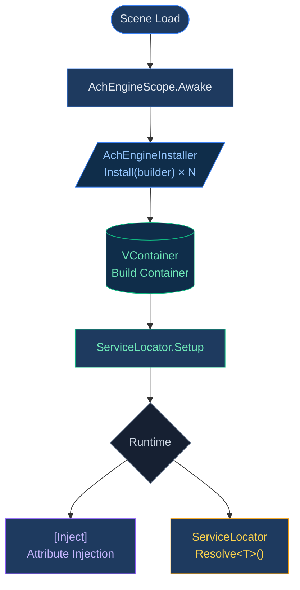

# DI System - Overview

AchEngine's DI layer does not expose [VContainer](https://github.com/hadashiA/VContainer) directly.
Instead, it provides a lightweight abstraction layer.

:::info Optional Module
The actual DI container is enabled only when VContainer (`jp.hadashikick.vcontainer`) is installed.
Without it, `ServiceLocator` can still be used through manual setup.
:::

## Core Components

| Class | Role |
|---|---|
| `AchEngineScope` | Scene entry point that wraps VContainer's `LifetimeScope` |
| `AchEngineInstaller` | Abstract class that defines service registration |
| `IServiceBuilder` | Service registration interface independent of VContainer |
| `ServiceLocator` | Static facade for resolving services at runtime |

## Basic Workflow



## `ServiceLifetime`

```csharp
public enum ServiceLifetime
{
    Singleton,   // One instance per container (default)
    Transient,   // New instance for every request
    Scoped,      // One instance per scope
}
```

## Next Steps

- [Learn more about AchEngineInstaller](/en/guide/di/installer)
- [Learn more about ServiceLocator](/en/guide/di/locator)
- [Read the DI lifecycle guide](/en/guide/di/lifecycle)

