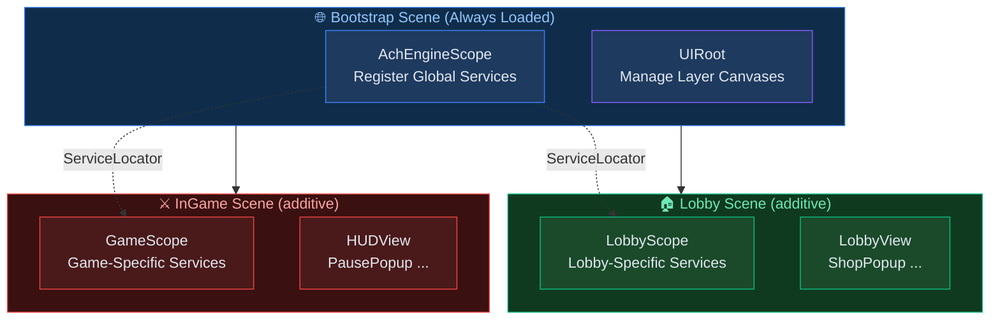

# DI Lifecycle Design

This guide covers the full DI-driven flow for scene transitions, popups, data serving, and in-game logic in AchEngine.

## Overall Structure



## 1. Bootstrap Scene - Register Global Services

Register services that live for the entire lifetime of the app in the `Bootstrap` scene.

```csharp
// GlobalInstaller.cs
public class GlobalInstaller : AchEngineInstaller
{
    [SerializeField] private GameConfig _config;

    public override void Install(IServiceBuilder builder)
    {
        builder
            // Configuration data
            .RegisterInstance<IGameConfig>(_config)
            // Table data service
            .Register<ITableService, TableService>()
            // UI service (auto-registered, but explicit registration is also fine)
            .Register<IUIService, UIService>()
            // Other global services such as audio and networking
            .Register<IAudioService, AudioService>()
            .Register<INetworkService, NetworkService>();
    }
}
```

```
[Bootstrap Scene]
 └── [AchEngineScope]  Installers: [GlobalInstaller]
 └── [UIRoot]
```

## 2. Scene Transition - Lobby to InGame

Create a separate `AchEngineScope` per scene to register and dispose scene-specific services.

```csharp
// SceneService.cs - Global service registered in the Bootstrap scene
public class SceneService : ISceneService
{
    public async UniTask LoadLobby()
    {
        // Unload the current game scene
        await UnloadCurrentGameScene();

        // Load the Lobby scene additively
        await SceneManager.LoadSceneAsync("Lobby", LoadSceneMode.Additive);

        // Show the lobby entry UI
        ServiceLocator.Resolve<IUIService>().Show<LobbyView>();
    }

    public async UniTask LoadInGame(int stageId)
    {
        // Close the lobby UI
        ServiceLocator.Resolve<IUIService>().CloseAll();

        // Unload the lobby scene and load the InGame scene
        await SceneManager.UnloadSceneAsync("Lobby");
        await SceneManager.LoadSceneAsync("InGame", LoadSceneMode.Additive);

        // Start gameplay
        ServiceLocator.Resolve<IGameService>().StartStage(stageId);
    }
}
```

```csharp
// LobbyInstaller.cs - Lobby scene only
public class LobbyInstaller : AchEngineInstaller
{
    public override void Install(IServiceBuilder builder)
    {
        builder
            .Register<IShopService, ShopService>()
            .Register<IFriendService, FriendService>();
    }
}
```

```csharp
// GameInstaller.cs - InGame scene only
public class GameInstaller : AchEngineInstaller
{
    public override void Install(IServiceBuilder builder)
    {
        builder
            .Register<IGameService, GameService>()
            .Register<IEnemySpawner, EnemySpawner>()
            .Register<IStageService, StageService>();
    }
}
```

:::tip Scene Scope Lifetime
When a scene is unloaded, `AchEngineScope.OnDestroy()` is called and the services for that scene are automatically released from the container.
:::

## 3. Popup Creation - Passing Data

Popups inherit from `UIView`, and data is injected through the callback passed to `Show()`.

```csharp
// ItemDetailPopup.cs
public class ItemDetailPopup : UIView
{
    [SerializeField] private Text _nameText;
    [SerializeField] private Text _descText;
    [SerializeField] private Text _priceText;
    [SerializeField] private Image _iconImage;

    private ItemData _item;

    public override UILayerId Layer => UILayerId.Popup;

    protected override void OnInitialize()
    {
        // Set up close buttons and other one-time wiring
    }

    // Data injection from the outside (called through the Show callback)
    public void SetItem(ItemData item, Sprite icon)
    {
        _item = item;
        _nameText.text  = LocalizationManager.Get(L.Item.Name(item.Id));
        _descText.text  = LocalizationManager.Get(L.Item.Desc(item.Id));
        _priceText.text = $"{item.Price:N0} G";
        _iconImage.sprite = icon;
    }

    protected override void OnClosed()
    {
        _item = null;
        _iconImage.sprite = null;
    }
}
```

```csharp
// Open the popup (for example, from an inventory screen)
var ui   = ServiceLocator.Resolve<IUIService>();
var icon = await AddressableManager.LoadAsync<Sprite>($"icon_{item.Id}");

ui.Show<ItemDetailPopup>(popup => popup.SetItem(item, icon.Result));
```

## 4. Data Serving - Table to Service

`TableService` wraps baked data so other services can consume it through DI.

```csharp
// GameService.cs
public class GameService : IGameService
{
    private readonly ITableService _tables;
    private readonly IUIService    _ui;

    // Constructor injection through DI
    public GameService(ITableService tables, IUIService ui)
    {
        _tables = tables;
        _ui     = ui;
    }

    public void StartStage(int stageId)
    {
        var stageData = _tables.Get<StageTable>().Get(stageId);
        var enemies   = _tables.Get<EnemyTable>().GetByStage(stageId);

        _ui.Show<GameHUDView>(hud => hud.SetStage(stageData));

        foreach (var enemy in enemies)
            SpawnEnemy(enemy);
    }
}
```

## 5. In-Game Access from `MonoBehaviour`

Because `MonoBehaviour` instances are not created directly by the DI container, they usually use `ServiceLocator`.

```csharp
// PlayerController.cs
public class PlayerController : MonoBehaviour
{
    private IGameService  _gameService;
    private IAudioService _audioService;

    private void Start()
    {
        // Resolve services at runtime through ServiceLocator
        _gameService  = ServiceLocator.Resolve<IGameService>();
        _audioService = ServiceLocator.Resolve<IAudioService>();
    }

    private void OnTriggerEnter(Collider other)
    {
        if (other.TryGetComponent<IEnemy>(out var enemy))
        {
            _gameService.OnPlayerHit(enemy.Damage);
            _audioService.PlaySFX("hit");
        }
    }
}
```

:::tip When `[Inject]` Works
If the container creates the object itself (for example, after `Register<PlayerController>()` and without manual `Instantiate`),
you can use `[Inject]`.
:::

## Summary of the Full Flow

```
App Start
 └── Load Bootstrap scene
      └── AchEngineScope → GlobalInstaller → Register global services
           └── Initialize ServiceLocator

Scene Transition
 └── ISceneService.LoadLobby()
      └── Load Lobby scene additively
           └── LobbyScope → LobbyInstaller → Register lobby services

Popup
 └── IUIService.Show<ItemDetailPopup>(popup => popup.SetItem(...))

InGame
 └── MonoBehaviour → ServiceLocator.Resolve<T>()
      or [Inject] attribute injection
```

