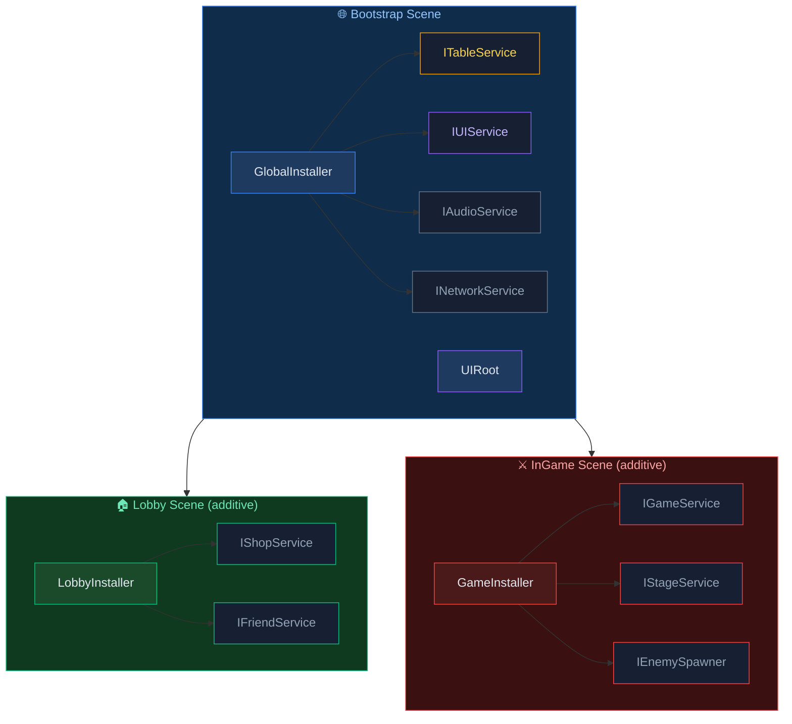

# Module Integration

This guide covers integration patterns for using AchEngine's DI, Table Loader, Localization, and Addressables modules together.

## Overall Structure



---

## Table Loader + Localization

This pattern stores item names and descriptions as localization keys.

### 1. Spreadsheet Design

```
| Id  | NameKey           | DescKey           | Price |
|-----|-------------------|-------------------|-------|
| 101 | item.sword.name   | item.sword.desc   | 500   |
| 102 | item.wand.name    | item.wand.desc    | 1200  |
```

### 2. Generated Data Class

```csharp
public partial class ItemData : ITableData
{
    public int    Id      { get; set; }
    public string NameKey { get; set; }
    public string DescKey { get; set; }
    public int    Price   { get; set; }
}
```

### 3. Runtime Composition

```csharp
using AchEngine;
using AchEngine.Localization;

public class ItemDetailView : UIView
{
    [SerializeField] private Text _nameText;
    [SerializeField] private Text _descText;
    [SerializeField] private Text _priceText;

    public void SetItem(int itemId)
    {
        var item = TableManager.Get<ItemTable>().Get(itemId);
        _nameText.text  = LocalizationManager.Get(item.NameKey);
        _descText.text  = LocalizationManager.Get(item.DescKey);
        _priceText.text = $"{item.Price:N0} G";
    }
}
```

### 4. Type-Safe Keys

After running localization code generation (the `L` class):

```csharp
// Direct reference to generated constants
_nameText.text = LocalizationManager.Get(L.Item.Sword.Name);

// Or use dynamic keys from table data
_nameText.text = LocalizationManager.Get(item.NameKey);
```

---

## Table Loader + Addressables

This pattern manages icon and sound addresses from table data.

### 1. Spreadsheet Design

```
| Id  | Name       | IconAddress       | SfxAddress     |
|-----|------------|-------------------|----------------|
| 101 | Iron Sword | icon_sword        | sfx_sword_hit  |
| 102 | Magic Wand | icon_wand         | sfx_wand_cast  |
```

### 2. Runtime Loading

```csharp
using AchEngine;
using AchEngine.Assets;

public class ItemDetailView : UIView
{
    [SerializeField] private Image _iconImage;

    private string _loadedAddress;

    public async void SetItem(int itemId)
    {
        var item = TableManager.Get<ItemTable>().Get(itemId);

        // Release the previous icon
        if (_loadedAddress != null)
        {
            AddressableManager.Release(_loadedAddress);
        }

        // Load the new icon
        _loadedAddress = item.IconAddress;
        var handle = await AddressableManager.LoadAsync<Sprite>(_loadedAddress);
        _iconImage.sprite = handle.Result;
    }

    protected override void OnClosed()
    {
        // Release the asset when the view closes
        if (_loadedAddress != null)
        {
            AddressableManager.Release(_loadedAddress);
            _loadedAddress = null;
        }
    }
}
```

---

## Example: Three Modules Together

When a popup opens, data is pulled from tables, text is localized, and sprites are loaded asynchronously through Addressables.

```csharp
public class ItemDetailPopup : UIView
{
    [SerializeField] private Text  _nameText;
    [SerializeField] private Text  _descText;
    [SerializeField] private Text  _priceText;
    [SerializeField] private Image _iconImage;

    private string _iconAddress;

    public override UILayerId Layer => UILayerId.Popup;

    public async void SetItem(int itemId)
    {
        var item = TableManager.Get<ItemTable>().Get(itemId);

        // Localization
        _nameText.text  = LocalizationManager.Get(item.NameKey);
        _descText.text  = LocalizationManager.Get(item.DescKey);
        _priceText.text = $"{item.Price:N0} G";

        // Addressables
        if (_iconAddress != null)
            AddressableManager.Release(_iconAddress);

        _iconAddress = item.IconAddress;
        var handle = await AddressableManager.LoadAsync<Sprite>(_iconAddress);
        if (handle.Status == AsyncOperationStatus.Succeeded)
            _iconImage.sprite = handle.Result;
    }

    protected override void OnClosed()
    {
        if (_iconAddress != null)
        {
            AddressableManager.Release(_iconAddress);
            _iconAddress = null;
        }
    }
}
```

### Open the Popup

```csharp
// Called when an item is clicked in the inventory UI
var ui = ServiceLocator.Resolve<IUIService>();
ui.Show<ItemDetailPopup>(popup => popup.SetItem(selectedItemId));
```

---

## Build a Service Layer with DI

Instead of calling static methods such as `TableManager.Get` or `LocalizationManager.Get` directly,
you can wrap them in service interfaces to improve testability.

```csharp
// Service interface
public interface IItemService
{
    ItemData GetItem(int id);
    string GetItemName(int id);
    string GetItemDesc(int id);
}
```

```csharp
// Implementation with TableService + LocalizationService injection
public class ItemService : IItemService
{
    private readonly ITableService        _tables;
    private readonly ILocalizationService _loc;

    public ItemService(ITableService tables, ILocalizationService loc)
    {
        _tables = tables;
        _loc    = loc;
    }

    public ItemData GetItem(int id)     => _tables.Get<ItemTable>().Get(id);
    public string GetItemName(int id)   => _loc.Get(GetItem(id).NameKey);
    public string GetItemDesc(int id)   => _loc.Get(GetItem(id).DescKey);
}
```

```csharp
// Registration
public class GlobalInstaller : AchEngineInstaller
{
    public override void Install(IServiceBuilder builder)
    {
        builder
            .Register<ITableService, TableService>()
            .Register<ILocalizationService, LocalizationService>()
            .Register<IItemService, ItemService>();
    }
}
```

```csharp
// Usage
public class ItemDetailPopup : UIView
{
    [Inject] private IItemService _items;

    public void SetItem(int itemId)
    {
        _nameText.text = _items.GetItemName(itemId);
        _descText.text = _items.GetItemDesc(itemId);
    }
}
```

---

## End-to-End Flow: Scene Transition + UI

```mermaid
sequenceDiagram
    participant App  as App Start
    participant Boot as Bootstrap Scene
    participant SL   as ServiceLocator
    participant SS   as SceneService
    participant GS   as GameService
    participant UI   as IUIService
    participant TBL  as TableManager
    participant LOC  as LocalizationManager
    participant ADDR as AddressableManager

    App->>Boot: Load scene
    Boot->>SL: Setup(global services)
    Note over SL: Global services are ready

    Note over SS,UI: Scene transition: Lobby → InGame
    SS->>UI: CloseAll()
    SS->>Boot: UnloadScene("Lobby")
    SS->>Boot: LoadScene("InGame")
    Boot->>SL: Add GameScope services
    SS->>GS: StartStage(stageId)
    GS->>TBL: Get&lt;StageTable&gt;().Get(stageId)
    TBL-->>GS: StageData
    GS->>UI: Show&lt;GameHUDView&gt;()

    Note over UI,ADDR: Popup flow
    UI->>UI: Show&lt;ItemDetailPopup&gt;(p => p.SetItem(id))
    UI->>TBL: Get&lt;ItemTable&gt;().Get(itemId)
    TBL-->>UI: ItemData
    UI->>LOC: Get(item.NameKey)
    LOC-->>UI: "Iron Sword"
    UI->>ADDR: LoadAsync&lt;Sprite&gt;(item.IconAddress)
    ADDR-->>UI: Sprite
```
