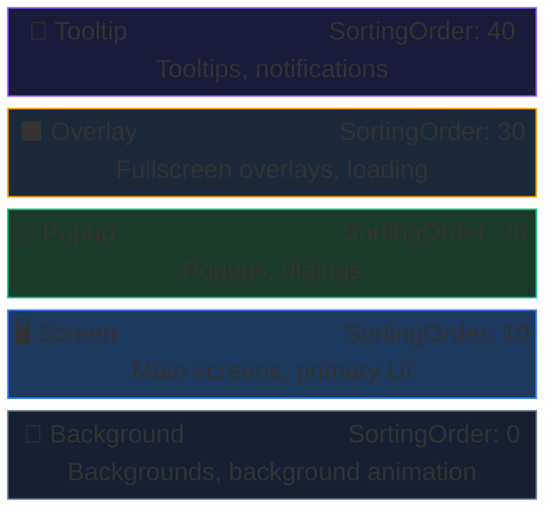

# UI System - Overview

AchEngine UI System is a **layer-based** UI management system.
Views registered in `UIViewCatalog` can be shown or closed by ID or type, and it includes object pooling, transition animations, and single-instance mode out of the box.

## Core Components

| Class | Role |
|---|---|
| `UIRoot` | Root canvas manager for every layer |
| `UIBootstrapper` | Initializes the UI system when the scene starts |
| `IUIService` / `UI` | Facade for showing and hiding views |
| `UIView` | Base class for every view |
| `UIViewCatalog` | ScriptableObject that registers view prefabs |
| `UIViewPool` | Pool for reusing view instances |

## Layer Structure



## Open / Close Views

```csharp
var ui = ServiceLocator.Resolve<IUIService>();

// -- Open ------------------------------------------------
ui.Show<MainMenuView>();                            // By type
ui.Show("MainMenu");                                // By string ID
ui.Show<ItemDetailView>(v => v.SetItem(item));      // Type + initialization callback
ui.Show("ItemDetail", v => ((ItemDetailView)v)
    .SetItem(item));                                // ID + callback

// -- Close -----------------------------------------------
ui.Close<MainMenuView>();                           // By type
ui.Close("MainMenu");                               // By string ID
ui.CloseAll();                                      // Close everything
ui.CloseLayer(UILayerId.Popup);                     // Close an entire layer
```

## Next Steps

- [UIView & lifecycle](/en/guide/ui/views)
- [UI Workspace](/en/guide/ui/workspace)

