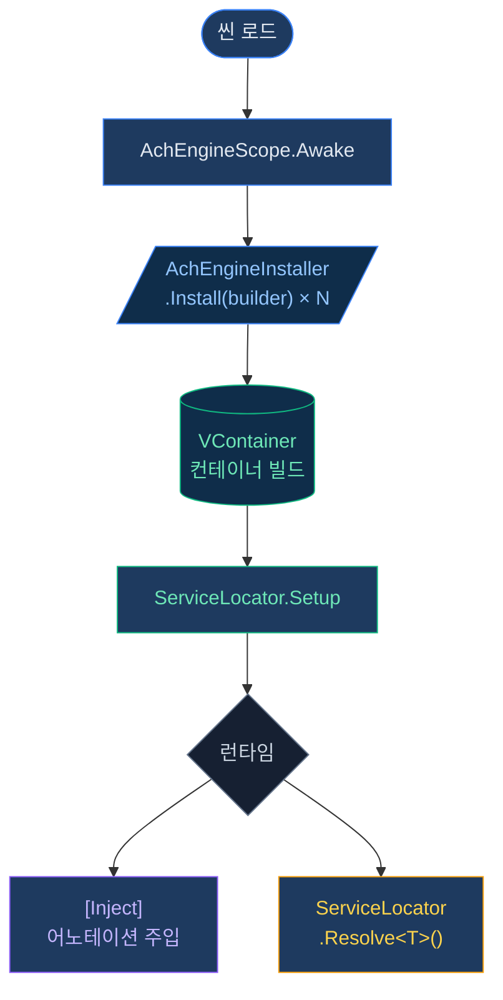

# DI 시스템 — 개요

AchEngine의 DI 레이어는 [VContainer](https://github.com/hadashiA/VContainer)를 직접 노출하지 않고,
간단한 추상화 레이어를 제공합니다.

:::info 선택적 모듈
VContainer(`jp.hadashikick.vcontainer`)가 설치된 경우에만 실제 DI 컨테이너가 활성화됩니다.
미설치 시에도 `ServiceLocator`는 수동 설정으로 사용할 수 있습니다.
:::

## 핵심 구성 요소

| 클래스 | 역할 |
|---|---|
| `AchEngineScope` | VContainer의 LifetimeScope를 래핑한 씬 진입점 |
| `AchEngineInstaller` | 서비스 등록을 정의하는 추상 클래스 |
| `IServiceBuilder` | 서비스 등록 인터페이스 (VContainer 비의존) |
| `ServiceLocator` | 런타임에 서비스를 조회하는 정적 파사드 |

## 기본 사용 흐름



## ServiceLifetime

```csharp
public enum ServiceLifetime
{
    Singleton,   // 컨테이너당 1개 인스턴스 (기본값)
    Transient,   // 요청마다 새 인스턴스
    Scoped,      // 스코프당 1개 인스턴스
}
```

## 다음 단계

- [AchEngineInstaller 자세히 보기](/guide/di/installer)
- [ServiceLocator 자세히 보기](/guide/di/locator)
- [DI 라이프사이클 가이드](/guide/di/lifecycle)
