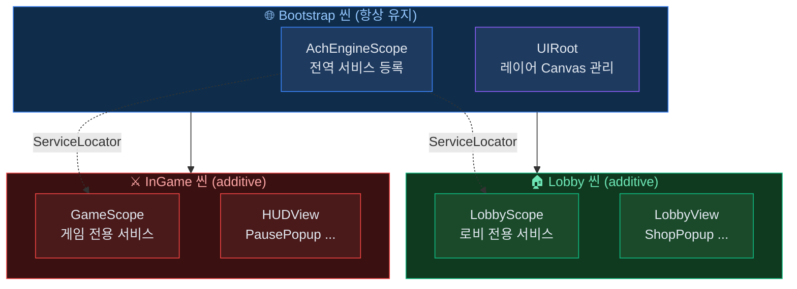

# DI 라이프사이클 설계

AchEngine에서 씬 전환, 팝업, 데이터 서빙, 인게임 로직을 DI로 연결하는 전체 흐름을 다룹니다.

## 전체 구조



## 1. Bootstrap 씬 — 전역 서비스 등록

게임 전체 수명 동안 유지되는 서비스를 `Bootstrap` 씬에서 등록합니다.

```csharp
// GlobalInstaller.cs
public class GlobalInstaller : AchEngineInstaller
{
    [SerializeField] private GameConfig _config;

    public override void Install(IServiceBuilder builder)
    {
        builder
            // 설정 데이터
            .RegisterInstance<IGameConfig>(_config)
            // 테이블 데이터 서비스
            .Register<ITableService, TableService>()
            // UI 서비스 (자동 등록되지만 명시도 가능)
            .Register<IUIService, UIService>()
            // 사운드, 네트워크 등 전역 서비스
            .Register<IAudioService, AudioService>()
            .Register<INetworkService, NetworkService>();
    }
}
```

```
[Bootstrap 씬]
 └── [AchEngineScope]  Installers: [GlobalInstaller]
 └── [UIRoot]
```

## 2. 씬 전환 — Lobby → InGame

씬 단위로 별도 `AchEngineScope`를 두어 씬 전용 서비스를 등록·해제합니다.

```csharp
// SceneService.cs — Bootstrap 씬에 등록된 전역 서비스
public class SceneService : ISceneService
{
    public async UniTask LoadLobby()
    {
        // 기존 게임 씬 언로드
        await UnloadCurrentGameScene();

        // Lobby 씬 additive 로드
        await SceneManager.LoadSceneAsync("Lobby", LoadSceneMode.Additive);

        // 로비 진입 UI 표시
        ServiceLocator.Resolve<IUIService>().Show<LobbyView>();
    }

    public async UniTask LoadInGame(int stageId)
    {
        // 로비 UI 닫기
        ServiceLocator.Resolve<IUIService>().CloseAll();

        // 로비 씬 언로드 → InGame 씬 로드
        await SceneManager.UnloadSceneAsync("Lobby");
        await SceneManager.LoadSceneAsync("InGame", LoadSceneMode.Additive);

        // 게임 시작
        ServiceLocator.Resolve<IGameService>().StartStage(stageId);
    }
}
```

```csharp
// LobbyInstaller.cs — Lobby 씬 전용
public class LobbyInstaller : AchEngineInstaller
{
    public override void Install(IServiceBuilder builder)
    {
        builder
            .Register<IShopService, ShopService>()
            .Register<IFriendService, FriendService>();
    }
}
```

```csharp
// GameInstaller.cs — InGame 씬 전용
public class GameInstaller : AchEngineInstaller
{
    public override void Install(IServiceBuilder builder)
    {
        builder
            .Register<IGameService, GameService>()
            .Register<IEnemySpawner, EnemySpawner>()
            .Register<IStageService, StageService>();
    }
}
```

:::tip 씬 Scope 수명 주기
씬이 언로드되면 `AchEngineScope.OnDestroy()`가 호출되어
해당 씬의 서비스가 자동으로 컨테이너에서 해제됩니다.
:::

## 3. 팝업 생성 — 데이터 전달

팝업은 `UIView`를 상속하고, `Show()` 콜백으로 데이터를 주입합니다.

```csharp
// ItemDetailPopup.cs
public class ItemDetailPopup : UIView
{
    [SerializeField] private Text _nameText;
    [SerializeField] private Text _descText;
    [SerializeField] private Text _priceText;
    [SerializeField] private Image _iconImage;

    private ItemData _item;

    public override UILayerId Layer => UILayerId.Popup;

    protected override void OnInitialize()
    {
        // 닫기 버튼 등 한 번만 세팅
    }

    // 외부에서 데이터 주입 (Show 콜백에서 호출)
    public void SetItem(ItemData item, Sprite icon)
    {
        _item = item;
        _nameText.text  = LocalizationManager.Get(L.Item.Name(item.Id));
        _descText.text  = LocalizationManager.Get(L.Item.Desc(item.Id));
        _priceText.text = $"{item.Price:N0} G";
        _iconImage.sprite = icon;
    }

    protected override void OnClosed()
    {
        _item = null;
        _iconImage.sprite = null;
    }
}
```

```csharp
// 팝업 열기 (인벤토리 등에서 호출)
var ui   = ServiceLocator.Resolve<IUIService>();
var icon = await AddressableManager.LoadAsync<Sprite>($"icon_{item.Id}");

ui.Show<ItemDetailPopup>(popup => popup.SetItem(item, icon.Result));
```

## 4. 데이터 서빙 — Table → Service

`TableService`가 베이크된 데이터를 래핑하고, 다른 서비스가 이를 주입받아 사용합니다.

```csharp
// GameService.cs
public class GameService : IGameService
{
    private readonly ITableService _tables;
    private readonly IUIService    _ui;

    // DI 생성자 주입
    public GameService(ITableService tables, IUIService ui)
    {
        _tables = tables;
        _ui     = ui;
    }

    public void StartStage(int stageId)
    {
        var stageData = _tables.Get<StageTable>().Get(stageId);
        var enemies   = _tables.Get<EnemyTable>().GetByStage(stageId);

        _ui.Show<GameHUDView>(hud => hud.SetStage(stageData));

        foreach (var enemy in enemies)
            SpawnEnemy(enemy);
    }
}
```

## 5. 인게임 — MonoBehaviour에서 접근

`MonoBehaviour`는 DI 컨테이너가 직접 생성하지 않으므로 `ServiceLocator`를 사용합니다.

```csharp
// PlayerController.cs
public class PlayerController : MonoBehaviour
{
    private IGameService   _gameService;
    private IAudioService  _audioService;

    private void Start()
    {
        // ServiceLocator로 런타임 조회
        _gameService  = ServiceLocator.Resolve<IGameService>();
        _audioService = ServiceLocator.Resolve<IAudioService>();
    }

    private void OnTriggerEnter(Collider other)
    {
        if (other.TryGetComponent<IEnemy>(out var enemy))
        {
            _gameService.OnPlayerHit(enemy.Damage);
            _audioService.PlaySFX("hit");
        }
    }
}
```

:::tip [Inject] 사용 가능한 경우
컨테이너가 생성하는 객체(`Register<PlayerController>()` 후 `Instantiate` 없이
VContainer가 직접 생성)는 `[Inject]`를 사용할 수 있습니다.
:::

## 전체 흐름 요약

```
앱 시작
 └── Bootstrap 씬 로드
      └── AchEngineScope → GlobalInstaller → 전역 서비스 등록
           └── ServiceLocator 초기화

씬 전환
 └── ISceneService.LoadLobby()
      └── Lobby 씬 additive 로드
           └── LobbyScope → LobbyInstaller → 로비 서비스 추가 등록

팝업
 └── IUIService.Show<ItemDetailPopup>(popup => popup.SetItem(...))

인게임
 └── MonoBehaviour → ServiceLocator.Resolve<T>()
      또는 [Inject] 속성 주입
```
