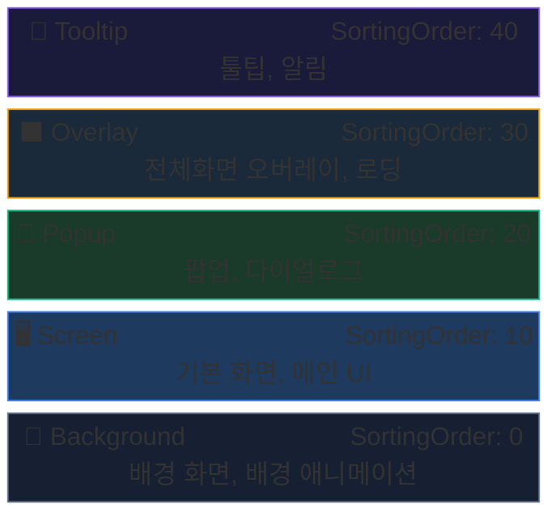

# UI 시스템 — 개요

AchEngine UI System은 **레이어 기반** UI 관리 시스템입니다.
`UIViewCatalog`에 등록된 View를 ID 또는 타입으로 Show/Close할 수 있으며,
Object Pool, 트랜지션 애니메이션, Single Instance 모드를 내장합니다.

## 핵심 구성 요소

| 클래스 | 역할 |
|---|---|
| `UIRoot` | 모든 레이어의 루트 Canvas 관리자 |
| `UIBootstrapper` | 씬 시작 시 UI 시스템 초기화 |
| `IUIService` / `UI` | View 표시·숨기기 파사드 |
| `UIView` | 모든 View의 기본 클래스 |
| `UIViewCatalog` | View 프리팹 등록 ScriptableObject |
| `UIViewPool` | View 인스턴스 재사용 풀 |

## 레이어 구조



## View 열기 / 닫기

```csharp
var ui = ServiceLocator.Resolve<IUIService>();

// ── 열기 ──────────────────────────────────────────────
ui.Show<MainMenuView>();                            // 타입
ui.Show("MainMenu");                                // 문자열 ID
ui.Show<ItemDetailView>(v => v.SetItem(item));      // 타입 + 초기화 콜백
ui.Show("ItemDetail", v => ((ItemDetailView)v)
    .SetItem(item));                                // ID + 콜백

// ── 닫기 ──────────────────────────────────────────────
ui.Close<MainMenuView>();                           // 타입
ui.Close("MainMenu");                               // ID
ui.CloseAll();                                      // 전체
ui.CloseLayer(UILayerId.Popup);                     // 레이어 전체
```

## 다음 단계

- [UIView & 수명 주기](/guide/ui/views)
- [UI Workspace](/guide/ui/workspace)
